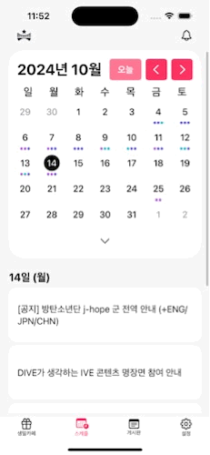

# 생일 카페 중계 플랫폼 iOS 앱 프로젝트

## 프로젝트 소개
이 프로젝트는 SwiftUI를 사용하여 프론트엔드를 구성하고, Swift를 사용하여 백엔드를 구현하여 앱 애플리케이션을 개발하는 것이 목표입니다.

X.com 에서 크롤링을 통해 정보를 가져오고 ChatGpt API를 통해 정제 후 SQLAlchemy를 통해 mySQL에 데이터를 저장합니다. 

Flask API를 사용하여 mySQL에 저장된 데이터를 앱에서 받아볼 수 있습니다.

해당 Repository는 https://github.com/indextrown/senior-project 에서 담당한 부분을 clone 및 수정하여 재게시하였습니다.

## 사용 및 담당한 기술 및 도구
- **프론트엔드**
    - SwiftUI
- **백엔드**
    - Swift
- **데이터베이스**
    - mySQL
    - SQLAlchemy
- **API**
    - Flask 

## 지원되는 iOS 디바이스
- **기본 계획**
    - iPhone XS Max
    - iPhone 11 Pro
    - iPhone 15 Pro Max
    - iPhone 16 Pro

- **최종 계획**
    - iOS 18을 지원하는 모든 디바이스
    
- **최적화된 디바이스**
    - iPhone 15 Pro

## 앱 화면
<table>
    <tr>
     <td align="center" width="200">
      
      <p><strong>메인화면</strong></p>
    </td>
     <td align="center" width="200">
      
      <p><strong>소셜 로그인</strong></p>
    </td>
    <td align="center" width="200">
      
      <p><strong>로그아웃</strong></p>
    </td>
  </tr>
  <tr>
    <td align="center" width="200">
      
      <p><strong>게시판 - 글 검색</strong></p>
    </td>
    <td align="center" width="200">
      
      <p><strong>게시판 - 글 작성</strong></p>
    </td>
        <td align="center" width="200">
      
      <p><strong>게시판 - 제목 검색</strong></p>
    </td>
  </tr>
  <tr>
    <td align="center" width="200">
      
      <p><strong>스케줄 - 확장</strong></p>
    </td>
    <td align="center" width="200">
      
      <p><strong>스케줄 - 디테일</strong></p>
    </td>
    <td align="center" width="200">
      
      <p><strong>스케줄 - 확장 디테일</strong></p>
    </td>
  </tr>
  <tr>
    <td align="center" width="200">
      
      <p><strong>스케줄 - 리스트</strong></p>
    </td>
    <td align="center" width="200">
      
      <p><strong>스케줄 - 날짜 변경</strong></p>
    </td>
  </tr>
  <tr>
    <td align="center" width="200">
      
      <p><strong>프로필 - 알람 토글</strong></p>
    </td>
    <td align="center" width="200">
      
      <p><strong>프로필 - 내가 올린 글</strong></p>
    </td>
    <td align="center" width="200">
      
      <p><strong>프로필 - 키워드 추가/삭제</strong></p>
    </td>
  </tr>
  <tr>
    <td align="center" width="200">
      
      <p><strong>생일카페 - 링크</strong></p>
    </td>
    <td align="center" width="200">
      
      <p><strong>생일카페 - 아티스트 추가</strong></p>
    </td>
    <td align="center" width="200">
      
      <p><strong>생일카페 - 아티스트 삭제</strong></p>
    </td>
  </tr>
  <tr>
    <td align="center" width="200">
      
      <p><strong>생일카페 - 날짜 변경</strong></p>
    </td>
  </tr>
</table>

## Database
본 프로젝트에서는 **AWS EC2** 서버에 배포된 **MySQL** 데이터베이스를 사용하였습니다.  
데이터베이스와의 원활한 연동을 위해 **SQLAlchemy**를 활용하여 쿼리문을 작성하고 데이터 조작을 수행하였습니다.  
이를 통해 확장성과 유지보수성을 고려한 효율적인 데이터 처리가 가능하도록 설계하였습니다.  

**매 30분마다 새로운 데이터가 추가**되며, 데이터가 추가될 때마다 **JSON 형식의 로그가 `.txt` 파일에 기록**됩니다.  
이러한 로그 기록을 통해 데이터 추가 내역을 추적하고, 서버 상태를 모니터링할 수 있도록 구현하였습니다.  

## 생일카페 데이터베이스
### 1. JSON 파일에서 데이터 로드  
- 저장된 JSON 파일에서 데이터를 불러옵니다.  
- 이후 단계에서 데이터 정제 및 중복 제거 과정을 거쳐 데이터베이스에 추가할 준비를 합니다.  

### 2. 테이블 생성 (없다면 생성)  
- 데이터를 삽입할 테이블이 존재하지 않는 경우 새롭게 생성합니다.  
- 기존 테이블이 있을 경우 그대로 유지하며, 데이터만 추가됩니다.  

### 3. 날짜 형식 보정  
- JSON에서 불러온 데이터의 날짜 형식을 통일합니다.  
- MySQL에서 사용 가능한 표준 날짜 형식으로 변환하여 저장합니다.  

### 4. 새로 들어오는 데이터 내 중복 제거  
- JSON 데이터 내부에서 동일한 항목이 중복으로 포함된 경우 이를 제거합니다.  
- 불필요한 데이터 중복을 방지하여 효율적인 데이터 관리를 수행합니다.  

### 5. 기존 테이블과 중복되는 데이터 제거  
- 데이터베이스에 이미 존재하는 데이터와 새로 추가될 데이터를 비교하여 중복된 항목을 필터링합니다.  
- 기존 데이터와 중복되지 않는 새로운 데이터만 삽입할 수 있도록 합니다.  

### 6. 특정 조건에 따라 데이터 필터링  
- 게시글 URL이 특정 조건(`x`)을 충족하지 않는 경우 해당 데이터를 필터링합니다.  
- 이를 통해 유효한 데이터만 데이터베이스에 저장됩니다.  

### 7. 데이터 삽입  
- 모든 필터링을 거친 후, 최종적으로 유효한 데이터만 데이터베이스에 추가합니다.
- 중복이 없고, `NULL` 값을 포함하지 않는 데이터만 저장됩니다.  

### 8. 로그 기록  
- 삽입된 데이터의 기록을 JSON 형식으로 `.txt` 파일에 저장합니다.  
- 이를 통해 데이터 추가 내역을 추적하고, 이후 분석 및 검토가 가능하도록 합니다.  

## 게시판 데이터베이스
- 중복 처리나 다른 알고리즘 없이 API 요청이 들어오면 바로 데이터를 데이터베이스에 추가합니다.

## API

이 API는 `Content` 키워드를 기준으로 요청 데이터를 구분하며, `Content`의 값에 따라 서로 다른 데이터를 가져올 수 있습니다.  

---

## 1. Content: "bboard" (게시판 데이터)  

게시판 데이터를 조회하거나 게시글을 작성할 때 사용합니다.  

### 📌 전체 게시판 데이터 조회  
```json
{
    "Content": "bboard",
    "all": "_"
}
```
**용도:** 게시판에 등록된 모든 데이터를 조회할 때 사용합니다.  

### 📌 게시글 작성 요청  
```json
{
    "Content": "bboard",
    "write": "_",
    "nickname": "{사용자 닉네임}",
    "title": "{게시글 제목}",
    "content": "{게시글 내용}",
    "post_date": "{yyyy-MM-dd / HH:mm:ss}",
    "artist": "{아티스트 이름}"
}
```
**용도:** 사용자가 새로운 게시글을 작성할 때 사용합니다.  

### 📌 특정 사용자의 게시글 조회  
```json
{
    "Content": "bboard",
    "nickname": "{사용자 닉네임}"
}
```
**용도:** 특정 사용자가 작성한 게시글을 조회할 때 사용합니다.  

---

## 2. Content: "cafe" (생일카페 데이터)  

특정 날짜 범위 내에서 등록된 생일카페 데이터를 조회할 때 사용합니다.  

### 📌 생일카페 데이터 조회  
```json
{
    "Content": "cafe",
    "startDate": "{yyyy-MM-dd}",
    "endDate": "{yyyy-MM-dd}"
}
```
**용도:** 지정한 날짜 범위 사이에 등록된 생일카페 데이터를 가져올 때 사용합니다.  

---

## 3. Content: "image" (이미지 데이터)  

서버에 저장된 특정 이미지 파일을 불러올 때 사용합니다.  

### 📌 이미지 파일 불러오기  
```json
{
    "Content": "image",
    "filename": "{원하는 이미지 파일명}"
}
```
**용도:** 특정 이미지 파일을 서버에서 가져올 때 사용합니다.  

---

## 4. Content: "x" (아이돌 공식 계정 데이터)  

특정 날짜 범위 내에서 아이돌 공식 계정에 작성된 데이터를 조회할 때 사용합니다.  

### 📌 아이돌 공식 계정 데이터 조회  
```json
{
    "Content": "x",
    "startDate": "{yyyy-MM-dd}",
    "endDate": "{yyyy-MM-dd}"
}
```
**용도:** 지정한 날짜 범위 내에서 작성된 아이돌 공식 계정 데이터를 가져올 때 사용합니다.  

---
